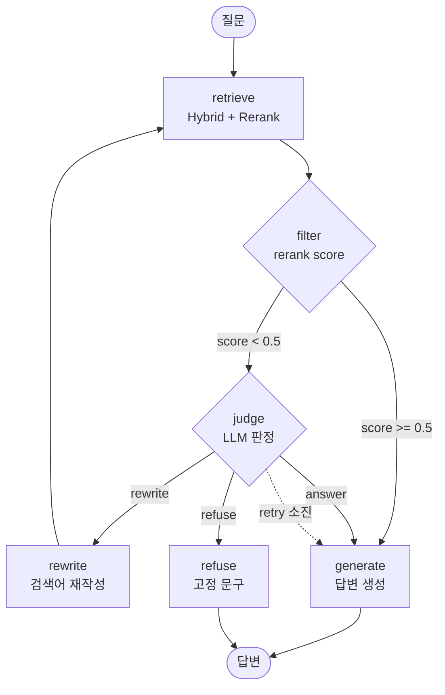

# Week 6 — Agentic RAG 워크플로우 (v3)

## 그래프 구조



## 노드

| 노드 | 역할 | LLM 호출 |
|---|---|---|
| `retrieve` | Hybrid(BM25+Dense, RRF k=60) top-20 → Cross-Encoder Rerank → top-5 | 없음 |
| `filter` | rerank 최고 점수로 판정자 호출 여부 결정 | **없음** |
| `judge` | 조각 내용을 읽고 answer / rewrite / refuse 결정 | 1회 |
| `rewrite` | 판정자가 만든 검색어 사용. 없을 때만 LLM 호출 | 0~1회 |
| `generate` | context 기반 답변 생성 | 1회 |
| `refuse` | 질문 언어에 맞춘 고정 거절 문구 | **없음** |

`retrieve`와 `generate`는 Baseline(`src/rag/pipeline.py`)과 동일한 함수를 호출한다.
검색기와 프롬프트가 같으므로 두 시스템의 차이는 판단 구조로 한정된다.

## 분기 기준

### filter — 점수는 필터로만 사용

```python
def route_after_filter(state):
    if state["max_score"] >= 0.5:
        return "generate"     # 근거 충분, LLM 호출 없이 통과
    return "judge"            # 판정자에게
```

**0.5의 근거** — bge-reranker의 시그모이드 중립점(원본 점수 0).
42문항 분포에서 0.472와 0.821 사이가 비어 있어 경계가 안정적이다.

**v1의 0.1 선을 제거했다.** 그 아래로 떨어진 문항이 판정 기회 없이 즉시 거절되어,
일반 정보가 존재하는 질문(qid 38)이 고정 문구만 받았기 때문이다.

### judge — LLM이 조각 내용을 읽고 판정

판정자가 받는 것

| 항목 | 용도 |
|---|---|
| 원 질문 | 판단 기준 |
| 현재 검색어 | rewrite 이탈 확인 |
| 질문 언어 | 문구 언어 |
| 재검색 횟수 / 최대 | rewrite 선택 가능 여부 |
| 조각 5개 전문 (각 800자) | 답변 가능성 판단 |
| 조각별 rerank 점수 | 관련도 분포 참고 |
| 조각별 출처 (문서명·페이지) | 문서 분산, 메타 정보 |

**받지 않는 것** — 평가셋 라벨(`q_type`, `expected_behavior`).
실제 서비스에 존재하지 않는 정보이므로 주면 평가 점수만 오르고 재현되지 않는다.

판정 순서를 강제한다. **decision이 마지막**이다.

```
asked      질문이 요구하는 것 (시점·대상·범위 조건 포함)
evidence   full | partial | related_only | none
category   in_scope | out_of_scope
reason     결론의 근거
decision   answer | rewrite | refuse
```

초기 버전에서 결론을 먼저 내고 사유를 사후 생성하는 현상이 관찰되어 순서를 바꿨다.

### 판정 정책

**refuse는 되돌릴 수 없다.** 생성 단계에 "근거 없으면 확인할 수 없다고 답하라"는 규칙이
있으므로 잘못된 answer는 회복되지만 잘못된 refuse는 회복되지 않는다.

따라서 refuse에는 적극적인 입증을 요구한다.

| decision | 조건 |
|---|---|
| **answer** | evidence가 full 또는 partial<br>개인 치료 결정 질문이라도 해당 주제의 일반 원칙이 조각에 있으면 포함<br>재검색 소진 후 refuse 조건이 성립하지 않을 때 |
| **rewrite** | evidence가 related_only 또는 none **이면서** category가 in_scope<br>재검색 횟수가 최대에 도달하지 않았을 때 |
| **refuse** | category가 out_of_scope (비용, 기관 평가, 개인 기록, 실시간 정보 등) |

**refuse의 근거가 되지 않는 것** — 지금 조각에 답이 없다 / rerank 점수가 낮다 /
질문이 요구한 시점의 자료를 찾지 못했다 / 개인 상황에 대한 확정적 판단을 내릴 수 없다

### rewrite / refuse 구분 축

판정자는 검색된 5개 조각만 보므로 "문서 어딘가에 답이 있는가"를 알 수 없다.
초기 프롬프트가 그것을 묻자 **rewrite가 0회 선택**되고 qid 4가 오거절되었다.

판정자가 실제로 볼 수 있는 축으로 바꿨다.

> 질문이 요구하는 정보의 **종류**가 이 문서 모음이 다루는 종류인가?

조각 5개만 봐도 문서 모음의 성격은 알 수 있으므로 판단이 가능해진다.

## 안전장치

**재검색이 이전보다 나쁘면 이전 결과 유지**

`retrieve` 노드는 새 검색의 최고 점수가 이전보다 낮으면 이전 `docs`를 그대로 둔다.
`route_history`에 `kept prev 0.494 > new 0.219` 형태로 기록된다.

Week 5-3 Multi-Query가 정상 검색을 악화시켜 미채택된 사례의 재발을 막는다.

**재시도 소진 시 rewrite를 answer로 대체**

0.1 선을 제거했으므로 판정자가 계속 rewrite를 고르면 무한 루프가 된다.
`MAX_RETRY`에 도달하면 rewrite를 answer로 바꾸고 사유에 기록한다.

**판정 JSON 파싱 실패 시 answer로 처리**

파싱 오류가 오거절로 이어지면 안 된다. 실패 사유는 `reason`에 남긴다.

## State

```python
class AgentState(TypedDict):
    question: str          # 원 질문 (불변)
    lang: str              # ko | en
    query: str             # 실제 검색어 (rewrite로 변경됨)
    docs: list[RetrievedDoc]
    max_score: float
    retry_count: int
    judge_calls: list[dict]      # 호출별 decision / evidence / category / reason
    answer: str
    decision: str                # answer | refuse
    route_history: list[str]     # 경로 기록 → Week 7 Routing Accuracy
    node_latencies: list[dict]   # 노드별 소요 시간
```

## 실행 경로 예시

**qid 4 — 근거 충분 (35문항이 이 경로, 판정자 미경유)**

```
retrieve(score=0.866) → filter(score=0.866, retry=0) → generate
```

**qid 32 — 범위 밖 (판정자가 즉시 거절)**

```
retrieve(score=0.030)
→ filter(score=0.030, retry=0)
→ judge -> refuse (evidence=none, category=out_of_scope)
→ refuse
```

**qid 38 — 점수는 낮으나 일반 정보 존재**

```
retrieve(score=0.027)
→ filter(score=0.027, retry=0)
→ judge -> answer (evidence=partial, category=in_scope)
→ generate
```

## 파일

```
src/rag/graph/
├── __init__.py    run() 노출
├── state.py       AgentState 정의
├── nodes.py       노드 6개 + route_after_filter / route_after_judge
└── graph.py       StateGraph 조립, run() 진입점
```

```python
from src.rag.graph import run

r = run("유방암 1기와 2기의 차이는 무엇인가요?")
r.answer, r.decision, r.max_score, r.retry_count
r.judged, r.judge_decision, r.judge_evidence, r.judge_category, r.judge_reason
r.route
```
