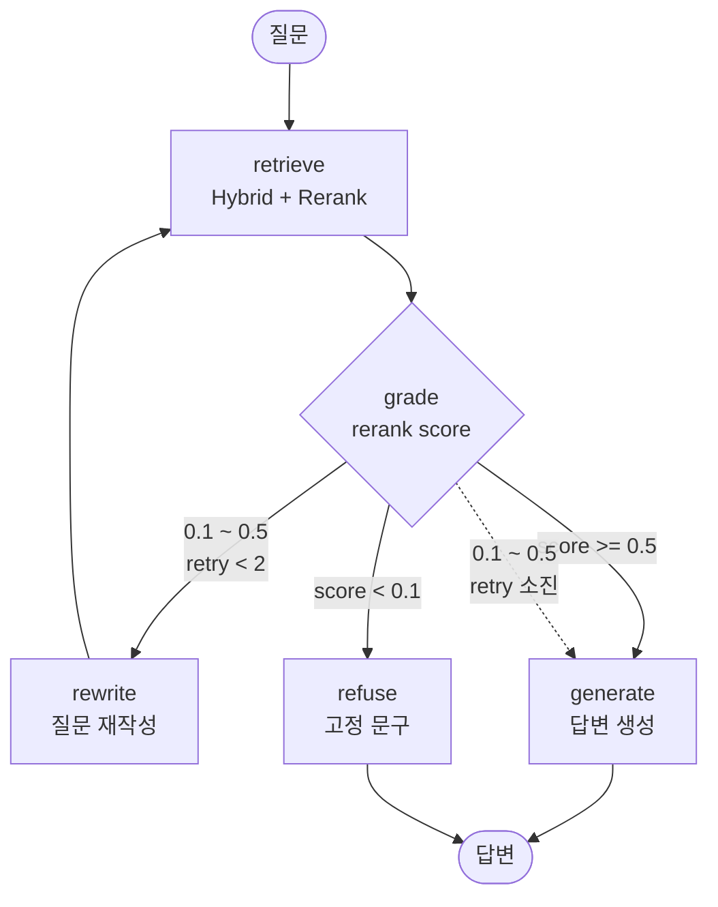

# Week 6 — Agentic RAG 워크플로우

## 그래프 구조



## 노드

| 노드 | 역할 | LLM 호출 |
|---|---|---|
| `retrieve` | Hybrid(BM25+Dense, RRF) → Cross-Encoder Rerank → top-5 | 없음 |
| `grade` | rerank 최고 점수로 분기 판단 | **없음** |
| `rewrite` | 검색되기 쉬운 표현으로 질문 재작성 | 1회 |
| `generate` | context 기반 답변 생성 | 1회 |
| `refuse` | 질문 언어에 맞춘 고정 거절 문구 | **없음** |

`retrieve`와 `generate`는 Baseline(`src/rag/pipeline.py`)과 동일한 함수를 호출한다.
검색기와 프롬프트가 같으므로 두 시스템의 차이는 판단 구조로 한정된다.

## 분기 기준

```python
def route_after_grade(state):
    score = state["max_score"]
    retry = state["retry_count"]

    if score >= 0.5:   return "generate"   # 근거 충분
    if score <  0.1:   return "refuse"     # 근거 없음
    if retry <    2:   return "rewrite"    # 판단 보류, 재검색
    return "generate"                      # 재시도 소진, 있는 근거로 답변
```

**임계값 근거** — `notebooks/week6_0_goldenset_check.ipynb`의 라벨 검증에서 관측한 분포.

| 구간 | score |
|---|---|
| 근거 명확 | 0.92 ~ 0.99 |
| 부분 관련 | 0.36 ~ 0.43 |
| 근거 없음 | 0.03 ~ 0.05 |

0.5는 bge-reranker의 시그모이드 중립점(원본 점수 0)에 해당한다.

## 안전장치

**재검색이 이전보다 나쁠 경우 이전 결과 유지**

`retrieve` 노드는 새 검색의 최고 점수가 이전보다 낮으면 이전 `docs`를 그대로 둔다.
`route_history`에 `kept prev 0.494 > new 0.219` 형태로 기록된다.

Week 5-3 Multi-Query가 정상 검색을 악화시켜 미채택된 사례의 재발을 막기 위한 규칙이다.

**재시도 소진 시 거절하지 않음**

0.1~0.5 구간의 문항은 대부분 `expected_behavior=answer`이므로,
재검색으로 개선되지 않아도 있는 근거로 답변한다. 과잉 거절을 막는다.

## State

```python
class AgentState(TypedDict):
    question: str          # 원래 질문 (불변)
    lang: str              # ko | en — 거절 문구 선택
    query: str             # 실제 검색어 (rewrite로 변경됨)
    docs: list[RetrievedDoc]
    max_score: float
    retry_count: int
    answer: str
    decision: str          # answer | refuse
    route_history: list[str]     # 경로 기록 → Week 7 Routing Accuracy
    node_latencies: list[dict]   # 노드별 소요 시간
```

## 실행 경로 예시

**qid 1 — 근거 충분 (37문항이 이 경로)**

```
retrieve(score=0.988) → grade(score=0.988, retry=0) → generate
```

**qid 32 — 근거 없음**

```
retrieve(score=0.030) → grade(score=0.030, retry=0) → refuse
```

**qid 4 — 재검색 (5문항이 이 경로)**

```
retrieve(score=0.150)
→ grade(score=0.150, retry=0)
→ rewrite → "유방암 1기와 2기의 구분은 어떻게 이루어지나요?"
→ retrieve(score=0.494)
→ grade(score=0.494, retry=1)
→ rewrite → "유방암 1기와 2기의 차별적 특성은 무엇인가요?"
→ retrieve(kept prev 0.494 > new 0.219)
→ grade(score=0.494, retry=2)
→ generate
```

## 파일

```
src/rag/graph/
├── __init__.py    run() 노출
├── state.py       AgentState 정의
├── nodes.py       노드 5개 + route_after_grade
└── graph.py       StateGraph 조립, run() 진입점
```

```python
from src.rag.graph import run

result = run("유방암 1기와 2기의 차이는 무엇인가요?")
result.answer, result.decision, result.max_score, result.retry_count, result.route
```
